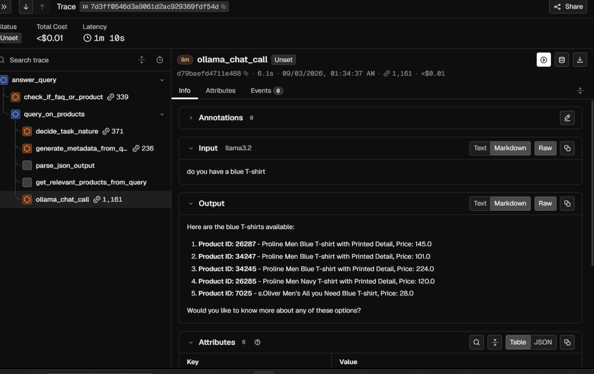

# Fashion RAG Assistant

A hybrid retrieval-augmented assistant for a clothing catalogue. It classifies
incoming queries, routes them to the right handler (FAQ / product search /
general chit-chat), and answers using data grounded in a real product
catalogue — not free-form LLM guessing.

## What it does

Given a user query, the assistant:

1. **Classifies intent** — is this an FAQ question, a product question, or
   neither (`classification.py`).
2. **Routes accordingly**:
   - **FAQ** → answered directly from a small FAQ context block (`faq.py`).
   - **Product** → the query is further classified as *creative* (e.g. "put
     together a look for a wedding") or *technical* (e.g. "do you have blue
     dresses"), which sets the generation temperature/top_p. Metadata
     (gender, category, colour, price range, etc.) is extracted from the
     query as structured JSON, constrained to the **actual values present in
     the catalogue** (via JSON Schema enums) so the model can't invent
     categories or values that don't exist in the data. Those filters are
     applied to a vector search over the product catalogue in Weaviate, with
     progressive filter relaxation if a filter combination returns too few
     results (`metadata_extraction.py`, `retrieval.py`, `generation.py`).
   - **Other** → answered as general conversation, with short-term chat
     memory for context (`assistant.py`).

## Architecture

```
                                   [ User Query ]
                                         │
                                         ▼
                          ┌─────────────────────────────┐
                          │      Intent Classifier      │
                          │   (FAQ / Product / Other)   │
                          └──────────────┬──────────────┘
                                         │
               ┌─────────────────────────┼─────────────────────────┐
               ▼                         ▼                         ▼
       [ FAQ Path ]                [ Product Path ]           [ Other Path ]
             │                           │                           │
     ┌───────┴───────┐           ┌───────┴───────┐           ┌───────┴───────┐
     │ Full FAQ      │           │ Task Nature   │           │ Chat Memory   │
     │ Context Dump  │           │ Classifier    │           │ (History)     │
     └───────┬───────┘           └───────┬───────┘           └───────┬───────┘
             │                           │                           │
             │                   ┌───────▼───────┐                   │
             │                   │ JSON Metadata │                   │
             │                   │ Extraction    │                   │
             │                   └───────┬───────┘                   │
             │                           │                           │
             │                   ┌───────▼───────┐                   │
             │                   │ Weaviate VDB  │◀────────┐         │
             │                   │ Vector Search │         │         │
             │                   └───────┬───────┘         │         │
             │                           │              too few      │
             │                   ┌───────▼───────┐        results    │
             │                   │ Progressive   │         │         │
             │                   │ Relaxation    ├─────────┘         │
             │                   └───────┬───────┘                   │
             │                           │ enough results            │
             └───────────────────────────┼───────────────────────────┘
                                         ▼
                          ┌─────────────────────────────┐
                          │        LLM Generator        │
                          │  (Grounded Final Answer)     │
                          └──────────────┬──────────────┘
                                         ▼
                                  [ Final Response ]
```

## Observability

Every request is traced end-to-end with OpenTelemetry, exported to
[Arize Phoenix](https://arize.com/docs/phoenix). Each query produces a full
nested trace — intent classification → task-nature classification → metadata
extraction → retrieval (including filter-relaxation attempts) → final
generation — with per-span token counts, latency, and cost.

Model costs are priced against
[together.ai](https://www.together.ai/pricing)'s published rates for the
equivalent hosted models, used as a production-cost proxy: the models run
locally via Ollama for free during development, but this lets you see what
each query would cost if the same pipeline were deployed against a hosted
inference API instead.



## Tech stack

- **Ollama** — local LLM inference (classification, metadata extraction,
  generation) and embeddings (`nomic-embed-text`)
- **Weaviate** — vector database for the product catalogue, running locally
  via Docker (see `docker-compose.yml`)
- **Arize Phoenix** — request tracing, cost tracking, and observability,
  running locally via Docker (see `docker-compose.yml`)
- **Python** — orchestration, no web framework; runs as a CLI loop

## Project structure

```
.
├── data/
│   ├── clothes_json.joblib      # ~44k product records
│   └── faq.joblib                # FAQ entries
├── src/
│   ├── config.py                 # model names, ports, thresholds — all in one place
│   ├── data_loader.py             # joblib loading, record cleaning, catalogue value extraction
│   ├── tracing.py                 # OpenTelemetry/Phoenix setup + reusable trace_span decorator
│   ├── classification.py          # intent + task-nature classification
│   ├── metadata_extraction.py     # query → structured filters (schema-constrained)
│   ├── retrieval.py               # Weaviate client/collection setup, filtering, search
│   ├── faq.py                     # FAQ context building and answering
│   ├── generation.py               # product-query pipeline and answer generation
│   └── assistant.py               # orchestrates the full pipeline + chat memory
├── scripts/
│   └── ingest_products.py         # one-time script to populate the Weaviate collection
├── notebooks/
│   └── exploration.ipynb          # original prototyping notebook
├── assets/
│   └── tracing_dashboard.png      # example Phoenix trace view (see Observability)
├── docker-compose.yml             # Weaviate + Phoenix
├── requirements.txt
├── .env.example
└── main.py                        # CLI entry point
```

## Setup

### 1. Prerequisites

- Python 3.10+
- Docker (for Weaviate and Phoenix)
- [Ollama](https://ollama.com) installed and running locally

### 2. Clone and install dependencies

```bash
git clone <repo-url>
cd <repo-folder>
python -m venv venv
source venv/bin/activate   # on Windows: venv\Scripts\activate
pip install -r requirements.txt
```

### 3. Pull the required Ollama models

```bash
ollama pull llama3.2
ollama pull nomic-embed-text
ollama pull deepseek-r1:7b   # used for intent classification
```

### 4. Configure environment

```bash
cp .env.example .env
```

Adjust values in `.env` if your Weaviate/Ollama setup differs from the
defaults (see `docker-compose.yml` for the exact ports it exposes).

### 5. Start Weaviate and Phoenix

```bash
docker compose up -d
```

This starts both the Weaviate vector database and the Phoenix tracing
dashboard. Verify Weaviate is ready:

```bash
python -c "from src.retrieval import get_weaviate_client; c = get_weaviate_client(); print(c.is_ready()); c.close()"
```

The Phoenix dashboard is available at
[http://localhost:6006](http://localhost:6006) — traces will start appearing
here as soon as you run a query in step 7.

### 6. Ingest the product catalogue

This populates the Weaviate collection from `data/clothes_json.joblib`.
Run this once (or whenever the underlying data changes):

```bash
python -m scripts.ingest_products
```

### 7. Run the assistant

```bash
python main.py
```

## Example interaction

```
You: What is your return policy?
Assistant: To initiate a return, please follow these steps...

You: Do you have blue dresses?
Assistant: Yes, I do have several blue dresses available. Here are the top results:
1. Product ID: 8483 - Forever New Women Creme de Menthe Blue Dresses (Price: 106.0)
2. Product ID: 24876 - United Colors of Benetton Women Blue Striped Dress (Price: 186.0)
...
```

## Design decisions worth noting

- **Different models for different jobs.** Intent classification uses
  `deepseek-r1:7b`, which performed more accurately on this task in testing.
  Metadata extraction uses `llama3.2` instead, since it reliably respects
  JSON Schema constraints — `deepseek-r1` was found to ignore or fail to
  produce schema-conformant output for structured extraction.
- **Catalogue-constrained metadata extraction.** The JSON Schema used for
  metadata extraction is built dynamically from the actual distinct values
  in the product data (e.g. real `masterCategory` values), rather than
  relying on the model to guess plausible-sounding categories. Without this,
  the model would sometimes invent values that don't exist in the catalogue
  (e.g. putting `"Dresses"` under `masterCategory` when the real value is
  `"Apparel"`), silently zeroing out filtered search results.
- **Progressive filter relaxation.** If a query's extracted filters are too
  specific and return few or no results, filters are dropped one at a time
  (least important first) until enough results are found, falling back to
  unfiltered semantic search as a last resort. Each attempt is logged as a
  trace attribute, so the dashboard shows exactly how many relaxation passes
  a slow query needed.
- **Tracing as a reusable decorator, not copy-pasted boilerplate.** `trace_span`
  in `tracing.py` wraps `contextlib.contextmanager`, so it works both as a
  `with trace_span(...)` block and as a `@trace_span(...)` decorator. Every
  traced function shares consistent span naming, exception recording
  (`record_exception` + `set_status`), and cost-relevant attributes
  (`llm.model_name`, token counts), instead of re-implementing this per call
  site.

## Known limitations

- FAQ answering is context-stuffing (all FAQ entries are included in every
  prompt), not real retrieval — fine at ~25 entries, but won't scale if the
  FAQ set grows significantly. It should eventually use the same
  vector-search pattern as the product path.
- Chat memory is in-process and single-session; there's no persistence or
  multi-user session handling.
- Multi-turn follow-ups (e.g. "what about in blue?" or "which one's
  cheapest?" after a product query) aren't context-aware in the
  classification/retrieval pipeline — only the general chat fallback path
  currently uses conversation history, so a follow-up can be misrouted or
  answered without the prior turn's context.
- Gender-based filtering (e.g. distinguishing adult vs. kids' clothing) is
  not fully reliable — queries can still surface kidswear alongside adult
  items in some cases.